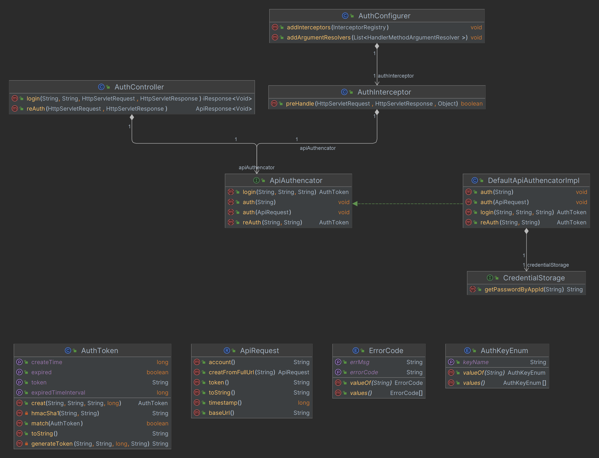

# 过滤器和拦截器

## 鉴权模块

### 架构



## 过滤器（Filter）

**tomcat-embed-core**提供，拦截的是URL，提供系统级别的过滤，能过滤所有的web请求，这一点，是拦截器无法做到的。

### 源码

```java
package jakarta.servlet;

public interface Filter {
    default void init(FilterConfig filterConfig) throws ServletException {
    }

    void doFilter(ServletRequest servletRequest, ServletResponse servletResponse, FilterChain filterChain) throws IOException, ServletException;

    default void destroy() {
    }
}
```

### 应用场景

- 自动登录
- 统一设置编码格式
- 访问权限控制
- 敏感字符过滤等

## 拦截器（Interceptor）

**spring-webmvc**提供，非系统级别的拦截，拦截器只能拦截部分web请求（URL）。（拦截器是基于反射机制实现的，拦截的对象只能是实现了接口的类，而不能拦截url这种连接）

```java
package org.springframework.web.servlet;

public interface HandlerInterceptor {
    default boolean preHandle(HttpServletRequest request, HttpServletResponse response, Object handler) throws Exception {
        return true;
    }

    default void postHandle(HttpServletRequest request, HttpServletResponse response, Object handler, @Nullable ModelAndView modelAndView) throws Exception {
    }

    default void afterCompletion(HttpServletRequest request, HttpServletResponse response, Object handler, @Nullable Exception ex) throws Exception {
    }
}
```

### 应用场景

- 日志记录：记录请求信息的日志
- 权限检查：如登录检查
- 性能检测：检测方法的执行时间

## 对比

主要区别

1. Filter是Servlet规范规定的，拦截器是在Spring容器内的，是Spring框架支持的。
2. Filter是基于函数回调，拦截器是基于Java的反射机制。
3. Filter依赖于servlet容器，只能用于Web程序中。拦截器不依赖于servlet容器，既可以用于Web程序，也可以用于Application、Swing程序中。
4. 拦截器只能对action请求起作用，而过滤器则可以对几乎所有的请求起作用。
5. 拦截器可以访问action上下文、值栈里的对象，而过滤器不能访问。
6. 在action的生命周期中，拦截器可以多次被调用，而过滤器只能在容器初始化时被调用一次
7. 拦截器可以获取IOC容器中的各个bean，而过滤器就不行，这点很重要，在拦截器里注入一个service，可以调用业务逻辑。
8. Filter在只在Servlet前后起作用。而拦截器能够深入到方法前后、异常抛出前后等，因此拦截器的使用具有更大的弹性。所以在Spring构架的程序中，要优先使用拦截器。

从灵活性上说拦截器功能更强大些，Filter能做的事情它都能做，而且可以在请求前，请求后执行，比较灵活。Filter主要是针对URL地址做一个编码的事情、过滤掉没用的参数、安全校验（比较泛的，比如登录不登录之类），太细的活儿还是建议用interceptor。具体还得根据不同情况选择合适的。

过滤器（Filter）是在请求进入容器后，但还未进入Servlet之前进行预处理的。请求结束返回也是，是在Servlet处理完后，返回给前端之前。所以过滤器（Filter）的doFilter(
ServletRequest request, ServletResponse response, FilterChain chain
)的入参是ServletRequest ，而不是httpservletrequest。因为过滤器是在httpservlet之前。


